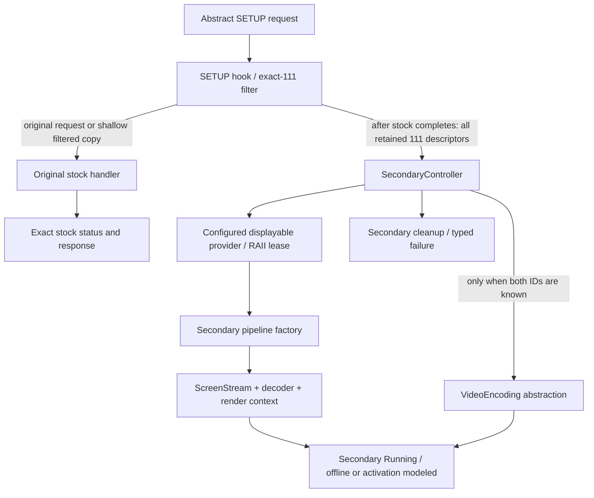

# Offline prototype v2 architecture

This is a host architectural model for Audi MIB3 Premium / MPR3
Linux/AArch64. All device services below are injected abstractions with host
mocks. These arrows do not claim operational vehicle functionality.



`AirPlaySetupHook` depends on `ISetupRequest`, `ISetupDescriptor`,
`ISecondaryController`, an injected original handler, and optional `IEventSink`.
It has no dependency on concrete MockCF objects or secondary construction.
No-111 requests reuse the original request object. Filtered requests reuse
original non-111 descriptors, including 110 and unfamiliar types on either
side of 111; opaque descriptor and request fields stay in the adapter.
Malformed requests or failed copying forward the original request unchanged
and do not start secondary work.

`SecondaryController` validates configuration, retains the full collection,
applies a documented single-screen prototype policy, acquires a displayable,
constructs a pipeline through a factory, starts stream/decoder, and models
`setActiveDisplayable(displayID, displayableID)` only with both IDs known.
`SecondarySessionOwner` owns stream/decoder/render context. The controller owns
the displayable lease and destroys it after the pipeline. Cleanup is
deterministic after partial startup, failure, stop, and destruction. Independent
attempts can start after cleanup. Secondary failures never change stock status.

```text
mpr3_tests -> mpr3_mocks -> mpr3_core
           ----------------> mpr3_core

mpr3_core:
  hook -> request/descriptor + secondary control + event interfaces
  controller -> config + displayable provider + pipeline factory + VideoEncoding
  pipeline owner -> stream + decoder + render context interfaces

mpr3_mocks:
  MockCF request adapters + mock stock handler + mock lifecycle services
  mock pipeline factory + mock VideoEncoding + capability status mocks
```

Evidence-backed target shapes are the three-argument SETUP function, stock
stream 110 and rejection of 111, instance-oriented screen/decoder machinery,
configured displayable name resolution, and direct displayable-to-encoder
selection through VideoEncoding. Host ownership and lifecycle policies are
implementation proposals, not recovered target behavior.

The complete secondary advertisement, delegate slot, iOS trigger, P3695
parameter-17/ThemeAssets behavior, loader/COMM authorization, safe displayable,
active endpoint/service variant, concurrent target lifecycle, and output
restoration remain UNKNOWN. No production adapter or deployment code is added.
See [v2 details](offline-prototype-v2.md) and the unchanged
[Phase 5/6 evidence index](../research/analysis/README.md).
