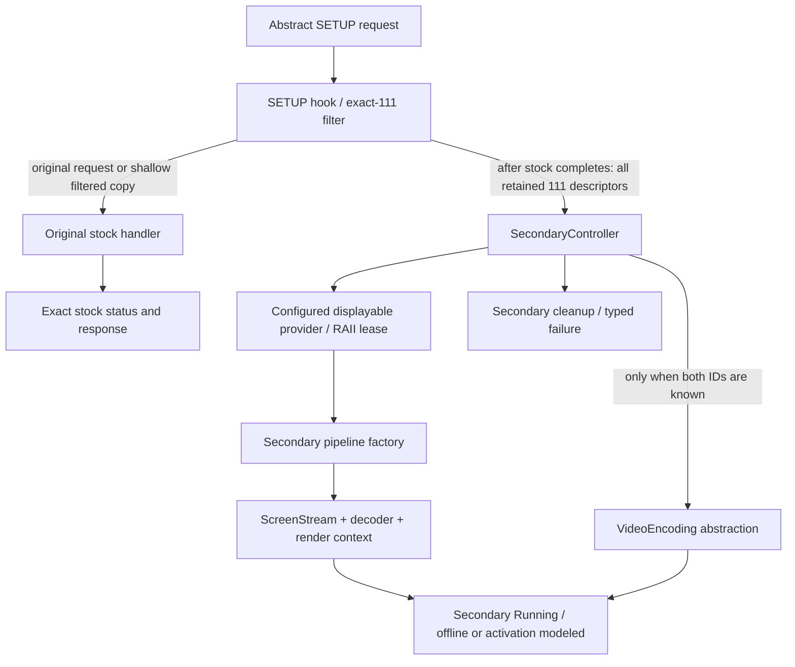

# Offline prototype v2 architecture

This is a host architectural model for Audi MIB3 Premium / MPR3
Linux/AArch64. All device services below are injected abstractions with host
mocks. These arrows do not claim operational vehicle functionality.

Stage 3 adds a separate opt-in boundary. Its pass-through has no connection to
filtering or secondary orchestration:

```text
                  TARGET BOUNDARY
                        |
       AirPlay C ABI entrypoint (unlinked OBJECT)
                        |
                pass-through bridge
                        |
               original resolver
                        |
         stock libairplay (future runtime only)

Independent offline integration (not called by C entrypoint):
             P3695 CFLite request adapter
                        |
           splitSecondaryDescriptors in core

Future secondary runtime branch — NOT IMPLEMENTED:
              target secondary binding
                        |
                        v
                   mpr3_core
                        |
              SecondaryController
                /       |       \
               /        |        \
        display-init  pipeline   COMM
          adapter     adapter    adapter
```

The canonical SETUP declaration lives in
`target/include/mpr3/target/airplay_setup_abi.hpp`. One typed lookup per call
rejects null/self-address results without a mutable cache. The bridge preserves
pointers and exact stock status; unavailability carries no AirPlay status.
The entry requires undefined runtime resolver/failure-policy integration and
is excluded from core and test runtime. POSIX lookup is separately opt-in.
See [target contracts](target-contracts.md), [CF contract](corefoundation-target-contract.md)
and [later adapters/restoration blocker](target-adapter-contracts.md).
The [CFLite adapter](cf-setup-adapter.md) uses an immutable resolved API and a
shared context owning dynamic streams/type keys. Borrowed requests preserve
caller ownership; copied requests and retained descriptors release their own
references. Its offline filter delegates exact111 selection to existing core
and exposes original-request selection on failure. No target secondary binding
or real stock invocation is added to that path.



`AirPlaySetupHook` depends on `ISetupRequest`, `ISetupDescriptor`,
`ISecondaryController`, an injected original handler, and optional `IEventSink`.
It has no dependency on concrete MockCF objects or secondary construction.
No-111 requests reuse the original request object. Filtered requests reuse
original non-111 descriptors, including 110 and unfamiliar types on either
side of 111; opaque descriptor and request fields stay in the adapter.
Malformed requests or failed copying forward the original request unchanged
and do not start secondary work.

`SecondaryController` validates configuration, retains the full collection,
applies a documented single-screen prototype policy, acquires a displayable,
constructs a pipeline through a factory, starts stream/decoder, and models
`setActiveDisplayable(displayID, displayableID)` only with both IDs known.
`SecondarySessionOwner` owns stream/decoder/render context. The controller owns
the displayable lease and destroys it after the pipeline. Cleanup is
deterministic after partial startup, failure, stop, and destruction. Independent
attempts can start after cleanup. Secondary failures never change stock status.

```text
mpr3_tests -> mpr3_mocks -> mpr3_core
           ----------------> mpr3_core

mpr3_core:
  hook -> request/descriptor + secondary control + event interfaces
  controller -> config + displayable provider + pipeline factory + VideoEncoding
  pipeline owner -> stream + decoder + render context interfaces

mpr3_mocks:
  MockCF request adapters + mock stock handler + mock lifecycle services
  mock pipeline factory + mock VideoEncoding + capability status mocks

Opt-in target layer (core has no dependency on it):
  mpr3_target_contracts (STATIC) -> typed resolver + pass-through bridge
  mpr3_target_entry_object (OBJECT) -> undefined runtime integration contracts
  mpr3_target_header_object (OBJECT) -> isolated ABI consumer
  mpr3_target_tests -> target contracts + core (default-config check only)
  mpr3_target_cf_adapter (STATIC) -> CFLite ABI/API + request interfaces + core filter
  mpr3_target_cflite_header_object (OBJECT) -> isolated low-level CFLite ABI consumer
  mpr3_target_cf_tests -> CF adapter + test-only fake CFLite runtime
```

Evidence-backed target shapes are the three-argument SETUP function, stock
stream 110 and rejection of 111, instance-oriented screen/decoder machinery,
configured displayable name resolution, and direct displayable-to-encoder
selection through VideoEncoding. Host ownership and lifecycle policies are
implementation proposals, not recovered target behavior.

Phase 7/8 recover the generic displays dispatch (delegate+0x18/server+0x30),
exact SETUP keys/helper ABIs and a bounded retaining shallow-copy contract.
These support the separate CFLite adapter without changing core architecture.
The complete client-valid secondary advertisement, iOS trigger, P3695
child17/ThemeAssets capability relevance, loader/COMM authorization, safe displayable,
active endpoint/service variant, concurrent target lifecycle, and output
restoration remain UNKNOWN. No production service adapter or deployment code is added.
See [v2 details](offline-prototype-v2.md) and the
[Phase 1–8 evidence index](../research/analysis/README.md); historical reports are unchanged.
